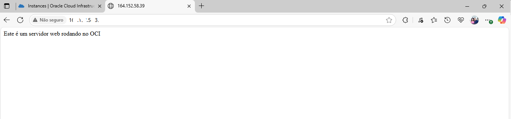

# 🧠 OCI Compute Demo

Projeto prático de criação e configuração de instância de computação na **Oracle Cloud Infrastructure (OCI)** com **servidor web Apache**, feito manualmente via console **Cloud Shell**.

---

## ✨ Objetivos

- Entender o **provisionamento de redes**** e **recursos** no OCI
- Criar uma **VCN** com **sub-rede pública**, **Gateway de Internet**, **regras de roteamento** e **segurança**
- **Instanciar** uma **VM** com **Oracle Linux** e **instalar Apache**
- **Validar** acesso via navegador com **IP público**

---

## 📁 Estrutura do projeto

- `README.md`: Guia completo passo a passo
- `servidor_rodando.PNG`: Print da página web ativa no navegador após instalação

---

## 🧪 Pré-requisitos

- **Conta** na **Oracle Cloud**
- **Acesso** ao OCI Console e ao **Cloud Shell**
- Conhecimento básico de **redes** e **SSH**
- Chave SSH pública/privada para autenticação

---

## 🛠️ Passo a passo resumido

1. Criar VCN manualmente
2. Criar sub-rede pública (CIDR: 10.0.0.0/24)
3. Provisionar Internet Gateway
4. Ajustar Tabela de Rotas e Lista de Segurança para acesso à porta 80
5. Criar instância com Oracle Linux + AMD Flex (1 OCPU / 6 GB RAM)
6. Conectar via SSH à instância
7. Instalar e habilitar Apache (`httpd`)
8. Validar no navegador via IP público

---

## 📷 Demonstração



---

## 🏁 Resultado

Você verá a mensagem:  
**"Este é um servidor web rodando no OCI"**  
acessando via navegador:  
`http://<IP_público_da_instância>`

---

## 📌 Autor

**Marcelo**, aprendiz em Cloud e Infraestrutura, entusiasta de tecnologia e em constante evolução 🚀

---

## 📣 Licença

Este projeto é livre para fins educativos e demonstração de conhecimento técnico.

---

# Versão em inglês

# 🚀 OCI Compute Demo

Hands-on project deploying a virtual machine (VM) in **Oracle Cloud Infrastructure (OCI)**, configuring networking manually, and hosting a simple Apache web server.

---

## 🎯 Objectives

- Understand how to provision OCI networking and compute resources
- Create a VCN, public subnet, Internet Gateway, routing and security rules
- Launch an Oracle Linux virtual machine (VM)
- Install Apache and expose a public web page
- Demonstrate real-world OCI usage for portfolio or job applications

---

## 📁 Project Structure

- `README.md`: Step-by-step guide in Markdown format
- `servidor_rodando.PNG`: Screenshot of running Apache server page
- *(You can expand later with shell scripts, Terraform, or diagrams!)*

---

## 🧰 Requirements

- Oracle Cloud account
- Access to OCI Console and Cloud Shell
- Basic knowledge of networks and SSH
- SSH key pair for authentication

---

## 🛠️ Setup Summary

1. Create Virtual Cloud Network (VCN) manually
2. Create public subnet with CIDR block `10.0.0.0/24`
3. Deploy Internet Gateway and update route table (`0.0.0.0/0`)
4. Update security list to allow TCP on port `80`
5. Launch VM with Oracle Linux + AMD Flex (1 OCPU / 6 GB RAM)
6. Add SSH public key for access
7. SSH into VM and install Apache
8. Validate by accessing IP in browser

---

## 💻 Apache Setup Commands

```bash
sudo yum update -y
sudo yum install httpd -y
sudo systemctl start httpd
sudo systemctl enable httpd
sudo firewall-cmd --add-service=http --permanent
sudo firewall-cmd --reload
echo "This is a web server running on OCI" | sudo tee /var/www/html/index.html
---

## 📷 Demo

